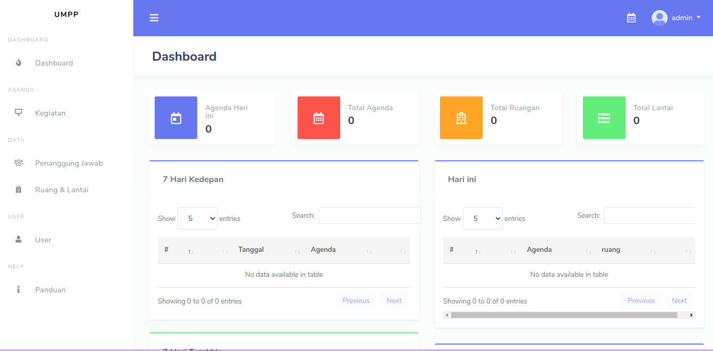
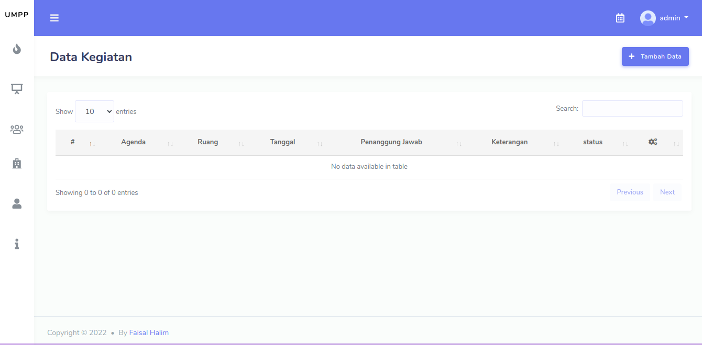

# Sistem Manajemen Ruangan.
web based app sistem manajemen ruangan menggunakan framework codeigniter 4 dan stisla bootstrap stisla sebagai template. web app yang dibuat sebagai project magang di **Universitas Muhammadiyah Pekajangan Pekalongan (UMPP)** tahun 2022.

## Demo
|       |       |
| :---: | :---: |
|||

## Fitur
<!-- tabble -->
|  |  |
| --- | --- |
| [x] Login | [x] CRUD Peminjaman
| [x] Logout | [x] CRUD User
| [x] Register | [x] CRUD Penanggung Jawab
| [x] Dashboard | [x] CRUD Kegiatan 
| [x] CRUD Ruangan & Lantai | [x] Panduan Penggunaan 

## Requirement
- PHP 8.0 or higher
- MySQL 5.7 or higher
- Composer

## Instalasi
1. Clone repository ini
2. Masuk ke folder project
3. Jalankan perintah `composer install`
4. Buat database baru
5. Copy file `.env.example` dan rename menjadi `.env`
6. Sesuaikan konfigurasi database pada file `.env`
7. Jalankan perintah `php spark migrate`
8. Jalankan perintah `php spark db:seed UserSeeder`
9. Jalankan perintah `php spark serve`
10. Buka browser dan akses `http://localhost:8080`

## Kontribusi
kontribusi sangat diharapkan untuk pengembangan web app ini. silahkan fork repository ini dan buat pull request untuk kontribusi.